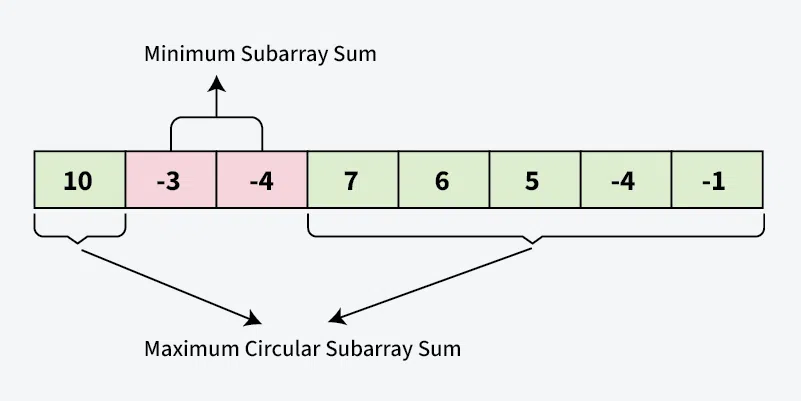

# Maximum Circular Sum Subarray

## Problem Statement

Given an array of integers, find the maximum sum of a subarray with the constraint that the subarray may be circular. In other words, the subarray can wrap around to the beginning or end of the array.

## Algorithm Approach

To solve this problem, we can use the Kadane's algorithm, which is a well-known algorithm for finding the maximum subarray sum in a linear time complexity.

1. Initialize two variables, `max_sum` and `min_sum`, to the first element of the array.
2. Initialize two more variables, `current_max` and `current_min`, to the first element of the array.
3. Iterate through the array starting from the second element.
4. Update `current_max` and `current_min` as follows:
    - `current_max = max(current_max + element, element)`
    - `current_min = min(current_min + element, element)`
5. Update `max_sum` and `min_sum` as follows:
    - `max_sum = max(max_sum, current_max)`
    - `min_sum = min(min_sum, current_min)`
6. If `max_sum` is negative, it means that all elements in the array are negative. In this case, return `max_sum` as the maximum circular sum.
7. Otherwise, return the maximum of `max_sum` and the sum of all elements in the array minus `min_sum`.

## Time Complexity

The time complexity of this algorithm is O(n), where n is the size of the input array. This is because we iterate through the array only once.
