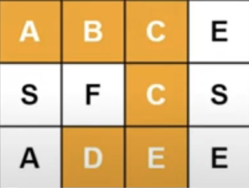

### Word Search in 2D Grid

### Overview

This program determines if a given word can be found in a 2D grid of letters. The word can be constructed from letters in the grid by moving horizontally or vertically from one letter to another adjacent letter. The same cell cannot be used more than once in the word search.

### Problem Definition

Given a 2D board of characters and a word, the task is to determine if the word exists in the grid. The word can be constructed by sequentially adjacent cells (horizontally or vertically). Each cell in the grid can be used only once per word search.

**Input**: A 2D board of characters and a string `word`.

**Output**: A boolean value - `true` if the word exists in the grid, otherwise `false`.

### Algorithm Overview

1. **Iterate Through the Grid**: The program starts by iterating over each cell in the grid. For each cell, if the character matches the first letter of the word, it initiates a recursive search from that cell.

2. **Recursive Backtracking (`backtrack`)**:
   - The function `backtrack` is a recursive function that checks if the current cell matches the current character in the word.
   - If the entire word is found (index reaches the length of the word), the function returns `true`.
   - Otherwise, the function marks the cell as visited by temporarily changing its value.
   - It then recursively checks the adjacent cells (up, down, left, and right) for the next character in the word.
   - If a path is found, it returns `true`; otherwise, it restores the cell's original value (backtracking) and continues the search.
   
3. **Boundary and Matching Checks**: During the search, boundary conditions are checked to ensure the search does not go out of bounds, and that each cell matches the corresponding character in the word.

### Example

Let the `board` be:

Let `word = "ABCCED"`.

**Steps**:
1. The search starts at cell `[0][0]` ('A') and proceeds with adjacent cells to form the word "ABCCED".
2. Through recursive calls, the word is found starting from cell `[0][0]`, moving right and down to cover the entire word.

**Output**: `true`

### Edge Cases

1. **Empty Grid**: If the board or word is empty, the function returns `false`.
2. **Word Not in Grid**: If no path can form the word, the function returns `false`.
3. **Repeated Letters in Word**: The word can contain repeated letters, but each cell in the grid can be used only once per word search.

