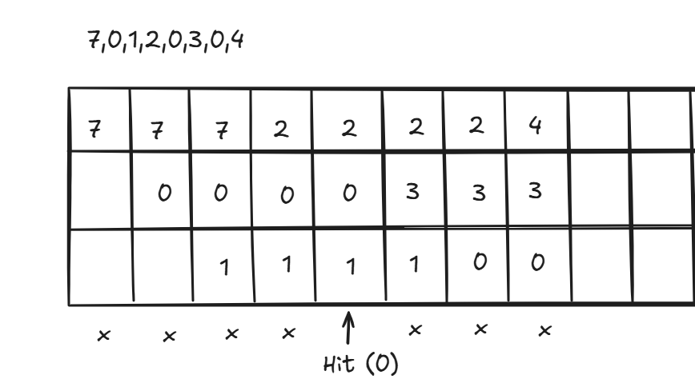

<h1>Introduction</h1>
A page replacement algorithm helps in managing the pages in memory, specifically when a page needs to be loaded  into the RAM but there is no space available. It helps to decide which page in the memory will be replaced.

<h2>Page hit and page fault</h2>
If the page is already available in memory, there is no need for replacement, this is referred to as page hit. If the page is not available in memory, the oldest page will have to be replaced as per FIFO algorithm to accomodate the new page. This is referred to as page fault.

 

<h1>FIFO Working </h1>
FIFO works by replacing the oldest page with the new page that needs to be brought into the memory.

<h2> Example </h2>
Let us consider a frame size of 3 and input sequence to be: 7,0,1,2,0,3,0,4

Each time, the oldest page in memory is replaced first. The total number of hits in this scenario is 1. And total number of page faults is 7.

<b>Advantage</b>: It is simple and easy to implement. 
<b>Disadvantage</b>: It can lead to more page faults 
<b>Belady's anomaly</b>: The increase in number of frames leading to more page faults is termed as Belady's Anomaly.