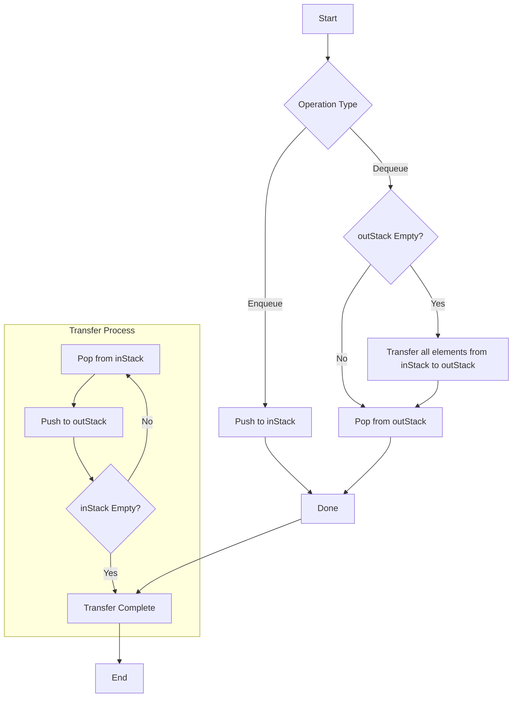

# Two-Stack Queue Implementation

This project implements a queue data structure using two stacks with a lazy transfer approach. The implementation provides O(1) amortized time complexity for both enqueue and dequeue operations.

## Algorithm Overview

The implementation uses two stacks:
- `inStack`: Used for enqueueing elements
- `outStack`: Used for dequeueing elements

### Key Operations

1. **Enqueue**: Push elements directly onto `inStack` - O(1)
2. **Dequeue**: 
    - If `outStack` is empty, transfer all elements from `inStack` to `outStack`
    - Pop and return the top element from `outStack`
    - Amortized O(1)

### Complexity

- **Time Complexity**:
    - **Enqueue**: $O(1)$
    - **Dequeue**: Amortized $O(1)$
- **Space Complexity**: $O(n)$, where $n$ is the number of elements in the queue.

### Example

Consider a queue with the following operations:

1. **Enqueue 1**
2. **Enqueue 2**
3. **Dequeue**
4. **Enqueue 3**
5. **Dequeue**

**Operations Breakdown**:

- **Enqueue 1**:
    - `inStack`: [1]
    - `outStack`: []

- **Enqueue 2**:
    - `inStack`: [1, 2]
    - `outStack`: []

- **Dequeue**:
    - Transfer elements from `inStack` to `outStack`: 
        - `inStack`: []
        - `outStack`: [2, 1]
    - Pop from `outStack`: 1
    - Result:
        - `inStack`: []
        - `outStack`: [2]

- **Enqueue 3**:
    - `inStack`: [3]
    - `outStack`: [2]

- **Dequeue**:
    - Pop from `outStack`: 2
    - Result:
        - `inStack`: [3]
        - `outStack`: []

### Conclusion

Implementing a queue using two stacks is an efficient way to achieve the FIFO behavior with LIFO structures. This approach ensures that both the **enqueue** and **dequeue** operations have an amortized constant time complexity, making it suitable for applications where performance and resource management are critical.

## Flowchart

