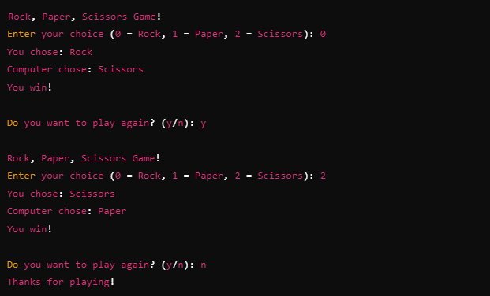

# Rock, Paper, Scissors Game

A simple and fun game called **"Rock, Paper, Scissors"**. This is a two-player game where each player selects one of three options: **Rock**, **Paper**, or **Scissors**. The rules are simple:

- **Rock** crushes **Scissors**.
- **Scissors** cuts **Paper**.
- **Paper** covers **Rock**.

The game can be played between a user and the computer, where the computer randomly chooses its option.

## How to Play

The code for the **Rock, Paper, Scissors** game in C is provided in the `program.c` file. 

### Explanation:

1. **Player's Input**:
   - The player is prompted to choose either **Rock** (`0`), **Paper** (`1`), or **Scissors** (`2`).
   - Input validation ensures that the player enters a valid option.

2. **Computer's Choice**:
   - The computer randomly selects its option using the `rand()` function, which is seeded with the current time to ensure different outcomes each time the game is played.

3. **Determining the Winner**:
   - The game checks the player’s and computer’s choices and compares them according to the rules:
     - **Rock** crushes **Scissors**.
     - **Scissors** cuts **Paper**.
     - **Paper** covers **Rock**.
   - The game then announces whether the player wins, the computer wins, or it’s a draw.

4. **Play Again**:
   - After each round, the player is asked if they want to play again. The game continues in a loop until the player chooses to quit.

## Sample Gameplay

